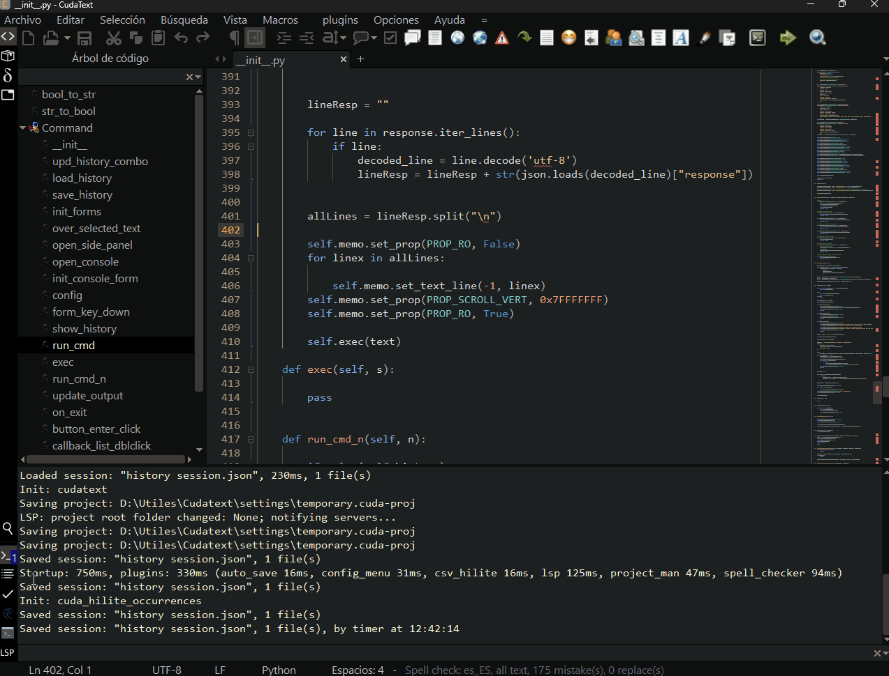
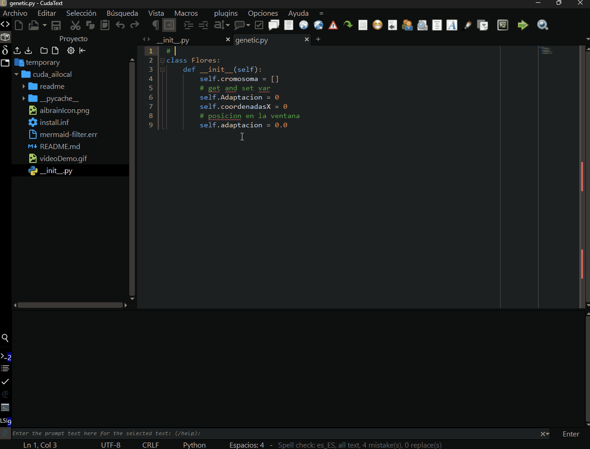

# cuda_ailocal

#### About this addon

It is a simple plugin for CudaText that can be connected to Ollama to use an LLM locally.

#### Installation

Download the repository content and unzip it in the `CudaText\py` folder.
It must be inside a folder: `cuda_ailocal`

#### Configuration

- Ctrl+Shift+P
- AI Local: Config

**Note:** for the moment only tested with Ollama

#### Prompt on the selected text

- Ctrl+Shift+P
- AI Local: Over Selected Text

The first line can be the prompt, the rest is the code.

---

# cuda_ailocal

#### Sobre este addon

Es un plugin sencillo para CudaText que se puede conectar a Ollama para utilizar un LLM de forma local.

#### Instalación

Bajar el contenido del repositorio y descomprimir en la carpeta `CudaText\py`
Debe estar dentro de una carpeta: `cuda_ailocal`

#### Configuración

- Ctrl+Shift+P
- AI Local: Config

> **Nota:** por el momento solo probado con Ollama

#### Prompt sobre el texto seleccionado

- Ctrl+Shift+P
- AI Local: Over Selected Text

La primera linea puede el prompt el resto es el código.

Author: Walter Wagner

License: MIT