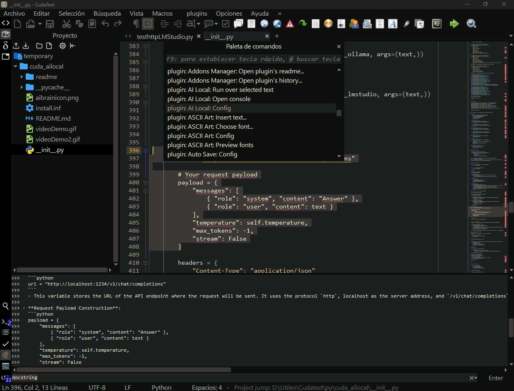

# cuda_ailocal

#### About this addon

Plugin for CudaText to connect to Ollama to use an LLM locally.

#### Installation

Download the repository content and unzip it in the `CudaText\py` folder.
It must be inside a folder: `cuda_ailocal`

#### Configuration

- Ctrl+Shift+P
- AI Local: Config

Tool option: ollama or lmstudio

URL Ollama: http://localhost:11434/api/generate 
URL LM Studio: http://localhost:1234/v1/chat/completions 

Option model examples:
- Ollama: qwen2.5-coder:3b
- LM Studio: qwen2.5-coder-3b-instruct

>Note: for the moment only tested with Ollama and LM Studio

#### Prompt on the selected text

- Ctrl+Shift+P
- AI Local: Over Selected Text

The first line can be the prompt, the rest is the code.

---

# cuda_ailocal

#### Sobre este addon

Plugin para CudaText para conectarse a Ollama para utilizar un LLM localmente.

#### Instalación

Bajar el contenido del repositorio y descomprimir en la carpeta `CudaText\py`
Debe estar dentro de una carpeta: `cuda_ailocal`

#### Configuración

- Ctrl+Shift+P
- AI Local: Config

Opción tool: ollama o lmstudio

URL Ollama: http://localhost:11434/api/generate 
URL LM Studio: http://localhost:1234/v1/chat/completions 

Opción model ejemplos:
- Ollama: qwen2.5-coder:3b
- LM Studio: qwen2.5-coder-3b-instruct

> **Nota:** por el momento solo probado con Ollama y LM Studio

#### Prompt sobre el texto seleccionado

- Ctrl+Shift+P
- AI Local: Over Selected Text

La primera linea puede el prompt el resto es el código.

Author: Walter Wagner

License: MIT